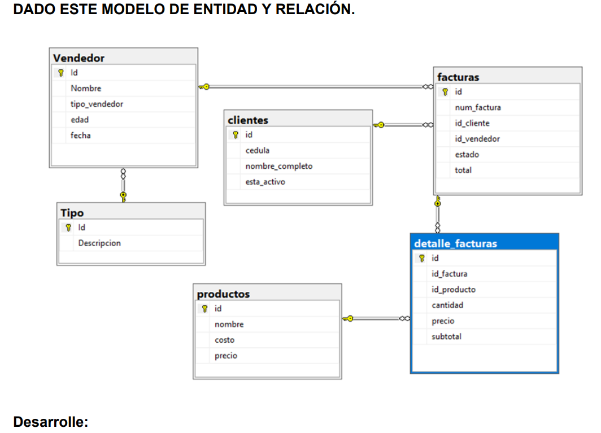

# Vendedor-backend
Este repositorio es hecho por **Rogeiro Bothia**, aqui se encuentra el desarrollo de los puntos planteados en la prueba.

En particular este repositorio contiene todos los puntos de la prueba y el codigo backend para el crud del vendedor desarrollado en _Spring boot con Java_, si desea ver tambien el codigo para el frontend, lo puedo encontrar en: **[vendedor-frontend](https://github.com/RogeiroBothia/vendedor-frontend)**

Las respuestas para los primeros tres puntos pueden ser vistas mas adelante en este mismo documento con la siguiente estructura:

1. Enunciado del punto
1. Respuesta del punto

---
## Planteamiento



1. Query que consulte el número de factura, cliente, estado, nombre del producto, cantidad, subtotal.  
**RTA:**  
```
SELECT  
    f.num_factura as numero_de_factura, 
	cl.nombre_completo as cliente, 
	f.estado, 
	pr.nombre as nombre_del_producto,
	df.cantidad, 
	df.subtotal
FROM detalle_facturas df
INNER JOIN facturas f on df.id_factura = f.id
INNER JOIN clientes cl on f.id_cliente = cl.id
INNER JOIN productos pr on df.id_producto = pr.id;
 ```
2. Query que consulte cuántos productos han vendido los vendedores ordenados
de mayor a menor para saber quienes venden mas.  
**RTA:**  
```
SELECT 
  SUM(cantidad) as total_productos_vendidos, 
  v.nombre as vendedor
FROM detalle_facturas 
INNER JOIN facturas f on id_factura = f.id
INNER JOIN vendedores v on f.id_vendedor = v.id
GROUP BY v.nombre
ORDER BY total_productos_vendidos desc;
```
3. Como puedo garantizar la consistencia de datos de las facturas. Ej: que la sumatoria del detalle de las facturas siempre sean igual al total de la factura del encabezado., ect……
**RTA:**  
Una posible solución podría ser: calcular la suma que da como resultado el subtotal en detalle_facturas y ese resultado compararlo con el total en facturas antes de guardar en la base de datos.  
Por ejemplo en spring boot, se implementaria en la capa de servicio un metodo que haga la comparacion con una anotacion @Transactional que si no cumple con la restriccion no modifique nada en base de datos.

4. Desarrollar un crud del vendedor. (crear modificar,consultar,eliminar en cualquier lenguaje de programación) Validar que el vendedor sea mayor de edad.